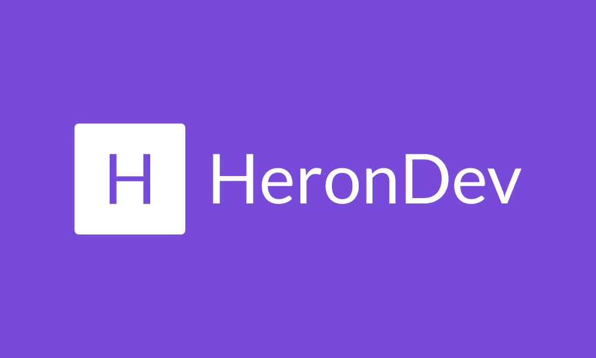

<div align="center">
  <h1> 📜 Portfólio </h1>
  
</div>
<br/>
<p align="center">
  
</p>

<p align="center">
  

  

  

   

     

</p>

<br>

## 🧪 Tecnologias

Esse projeto foi desenvolvido com as seguintes tecnologias:

- [NextJs](https://nextjs.org/)
- [Styled-Components](https://styled-components.com/)
- [Javascript](https://developer.mozilla.org/pt-BR/docs/Web/JavaScript)
- [Figma](http://figma.com/)

## 🚀 Como executar

Clone o projeto e acesse a pasta do mesmo.

```bash
$ git clone https://github.com/szHeron/NLW6-Letmeask
$ cd portfolio
```

Para iniciá-lo, siga os passos abaixo:
```bash
# Instalar as dependências
$ yarn ou npm install

# Iniciar o projeto
$ yarn dev ou npm run dev
```
O app estará disponível no seu browser pelo endereço http://localhost:3000.

## 💻 Projeto

Esse projeto foi construido com o proposito de servir como o meu portfólio pessoal, produzido inteiramente com o meu conhecimento nas tecnologias utilizadas.

## 🌟 Features

- [x] Consumo e criação de API Rest.

- [x] Tema escuro e claro.

- [x] Responsividade.


## 🔖 Layout

Você pode visualizar o layout do projeto através do link abaixo:

- [Layout Web](https://www.figma.com/file/883MwaS6WRiNZrweMr0saa/Personal-site?node-id=0%3A1) 

Lembrando que você precisa ter uma conta no [Figma](http://figma.com/).

## 📝 License

Esse projeto está sob a licença MIT. Veja o arquivo [LICENSE](LICENSE.md) para mais detalhes.

---
